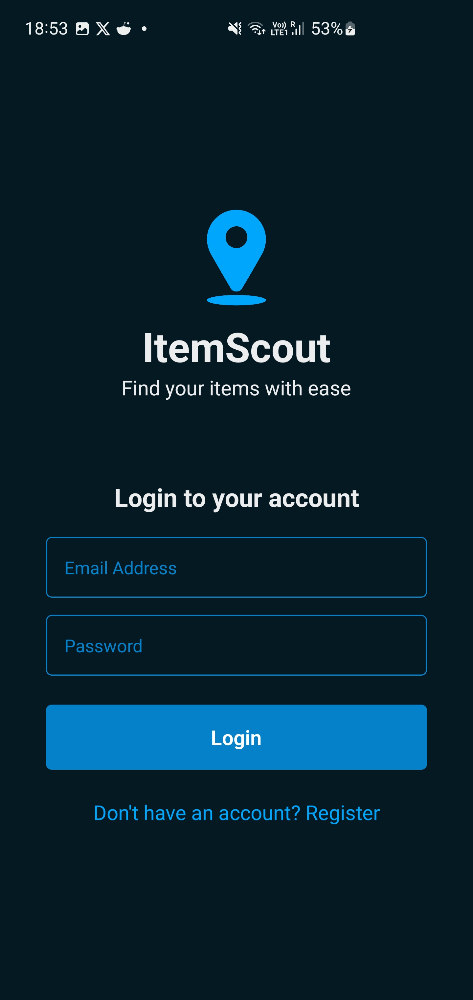
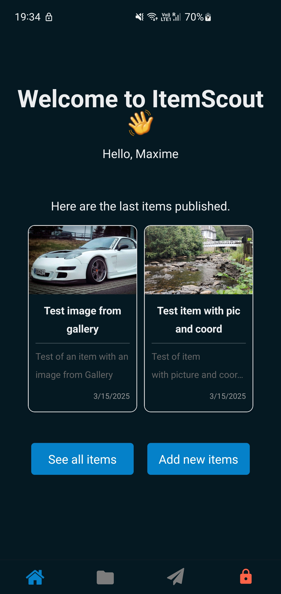
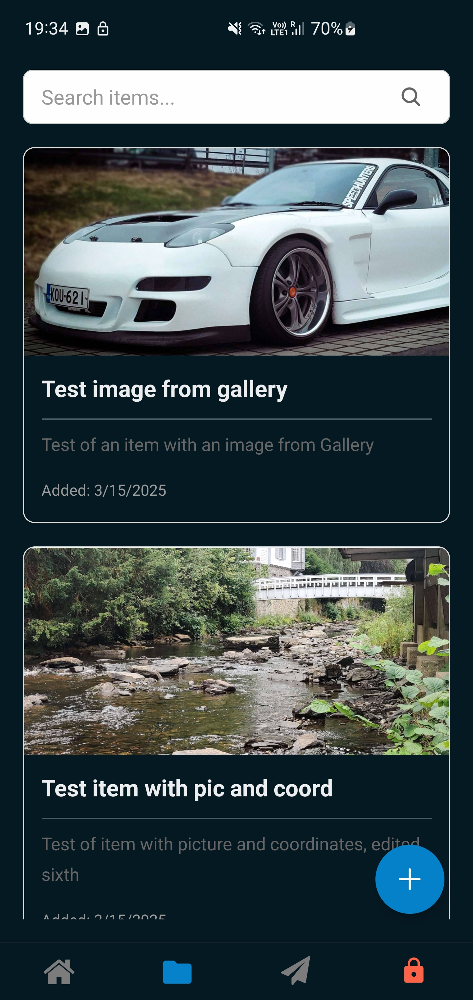
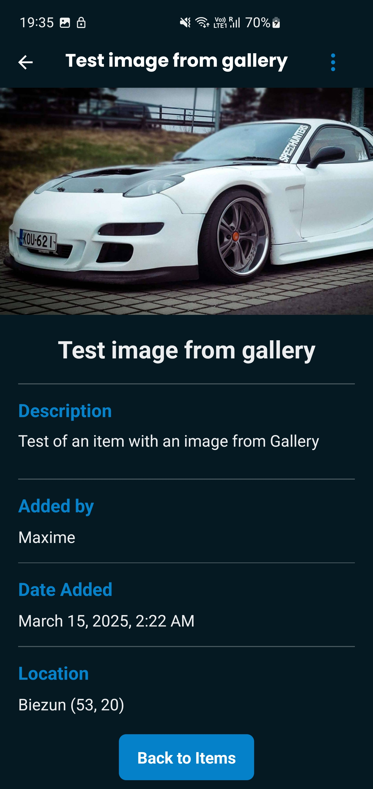
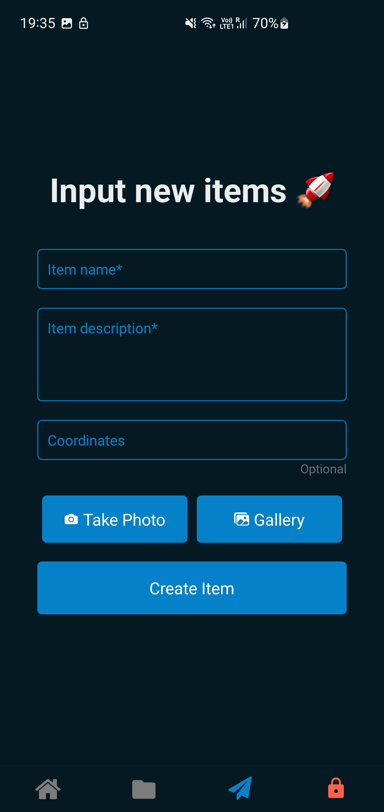

# ItemScout 📱 - Track Your Belongings Anywhere


## 📋 Overview

ItemScout is a modern mobile application designed to help you keep track of your personal belongings. With an intuitive interface and powerful features, you'll never lose your items again!

## ✨ Features

- **Item Management**: Create, view, edit, and delete your items
- **Image Capture**: Take photos or choose from gallery to visually document items
- **Location Tracking**: Save and view the geographical coordinates of your items
- **Search Functionality**: Quickly find items in your inventory
- **User Authentication**: Secure login and account management - Only edit and delete your items !
- **Responsive Design**: Works seamlessly on both iOS and Android devices

## 📱 Screenshots

Login Screen :



Main Screen :



Items List :



Item Details :



Create Item :



Edit Item :


## 🚀 Installation & Setup

### Prerequisites
- Node.js (v14 or later)
- npm or yarn
- Expo CLI (`npm install -g expo-cli`)
- For mobile development: Android Emulator

### Setup Instructions

1. **Clone the repository**
   ```bash
   git clone https://github.com/kazawai/ItemScout.git
   cd ItemScout
   ```

2. **Install dependencies**
   ```bash
   npm install
   ```

3. **Configure environment variables**
   In the `.env` file in the root directory, replace :
   ```
   EXPO_PUBLIC_NODE_ENV=production
   ```
   by :
   ```
   EXPO_PUBLIC_NODE_ENV=dev
   ```
   If you want to work on your own backend, otherwise, leave it.

4. **Start the backend server (if needed)**
   ```bash
   cd backend
   npm install
   ```
   In the `.env` file, replace :
   ```
   PORT=5000
   MONGO_URI=your_local_mongo_db
   JWT_SECRET=your_secret
   NODE_ENV=development
   ```

5. **Start the app**
   In a new terminal window:
   ```bash
   npx expo start
   ```

6. **Open the app**
   Scan the QR code with the Expo Go app on your phone, or press:
   - `a` for Android emulator
   - `w` for web browser

## 🧪 Testing

You can use the following test account to explore the app:
- **Email**: test@gmail.com
- **Password**: Password

## 🎨 Design

ItemScout features a sleek blue color palette:
- Primary Blue: #00A6FB
- Secondary Blue: #0582CA 
- Dark Blue: #006494
- Deep Blue: #003554
- Background: #051923

Color palette reference: [Coolors Palette](https://coolors.co/palette/00a6fb-0582ca-006494-003554-051923)

## 🛠️ Technologies Used

- **Frontend**: React Native, Expo, TypeScript
- **Backend**: Node.js, Express (hosted on Render)
- **Database**: MongoDB
- **Authentication**: JWT
- **Image Storage**: File system with Express static middleware
- **Reverse Geo-Coding**: Reverse Geo-Coding for coordinates

## 🤝 Contributing

As this project is made with Academic purposes, contributions are not open.

---

<p align="center">Made by KazaWai</p>